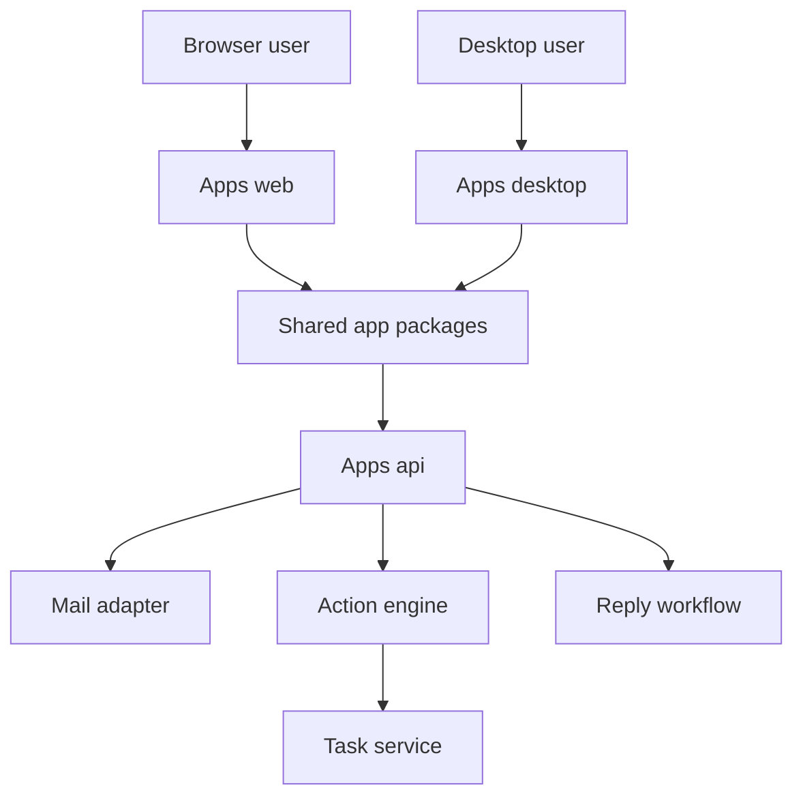
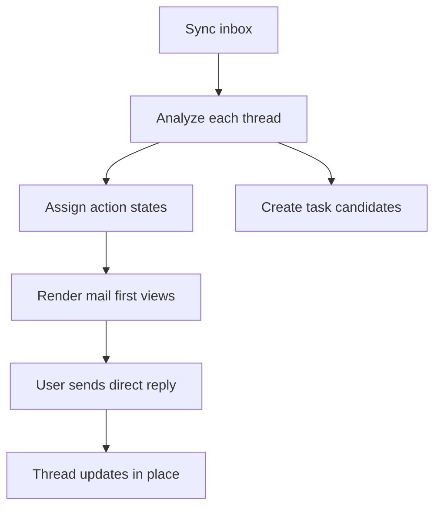

# InboxOS MVP

InboxOS is a mail-first AI workspace with one shared UI direction across the live web app and a planned macOS desktop shell.

## Monorepo Layout

- `apps/web`: Next.js host app for the current product surface
- `apps/desktop`: planned macOS desktop shell around the shared app packages
- `apps/api`: FastAPI backend for auth, sync, threads, and tasks
- `packages/app`: shared app shell and route-level page composition
- `packages/features`: mail, tasks, calendar, and auth feature workspaces
- `packages/ui`: shared UI chrome such as the left app rail
- `packages/lib`: shared API client, formatters, and mock data
- `packages/types`: shared TypeScript models
- `packages/config`: shared client-side configuration
- `docs`: product and technical documentation
- `ui`: local ignored checkout of upstream `shadcn/ui` for reference only

## Architecture



## Core Flows



## Local Development

### Prereqs

- Python 3.11+
- `uv`
- Node 20+
- `bun`
- Docker optional

### Backend

```bash
cp .env.example .env
# Set GOOGLE_CLIENT_ID and GOOGLE_CLIENT_SECRET in .env before using Google sign-in.

cd apps/api
uv sync --group dev
uv run uvicorn app.main:app --reload --host 0.0.0.0 --port 8000
```

Local auth sessions are now persisted in SQLite at `SESSION_DB_PATH` and survive API reloads and browser restarts until the configured TTL expires. For deployed environments, put `SESSION_DB_PATH` on persistent storage or sessions will still be lost on container or host replacement.

### Web

```bash
cd apps/web
bun install
NEXT_PUBLIC_API_BASE_URL=http://localhost:8000 bun run dev
```

Open [http://localhost:3000/mail](http://localhost:3000/mail).

### Desktop

`apps/desktop` is a shell scaffold only. It exists to keep the repo aligned with the future macOS-compatible packaging plan, but the web app remains the active runtime today.

### Git Hooks

Enable the versioned pre-commit hooks once per clone:

```bash
make install-hooks
```

The repo uses the Python `pre-commit` package. Hooks run `black` and `ruff` on `apps/api`, and `prettier` across the tracked JS, TS, CSS, JSON, and Markdown files in `apps/`, `packages/`, and `docs/`.

To run the same checks manually across the repo:

```bash
uvx pre-commit run --all-files
```

## Test And Lint

```bash
cd apps/api
uv run --group dev ruff check
uv run --group dev python -m pytest

cd ../web
bun run lint
bun run build
```

## Docker Compose

```bash
docker compose up --build
```

- API: [http://localhost:8000](http://localhost:8000)
- Web: [http://localhost:3000](http://localhost:3000)

## Deploy

### Web on Vercel

- project root: `apps/web`
- build command: `bun run build`
- start command: `bun run start`
- env: `NEXT_PUBLIC_API_BASE_URL`

### API on Railway

- service root: `apps/api`
- deploy with `apps/api/Dockerfile` or native Python build
- expose port `8000`
- set env vars from `.env.example`

## Current MVP Status

Implemented:

- mail-first shared UI structure for web and future desktop shell reuse
- Gmail sync stub with deterministic sample threads
- thread analysis summary and action-state assignment
- task generation from deadlines
- direct thread reply endpoint for the mail workspace
- mail, tasks, calendar, and auth surfaces in the web host app
