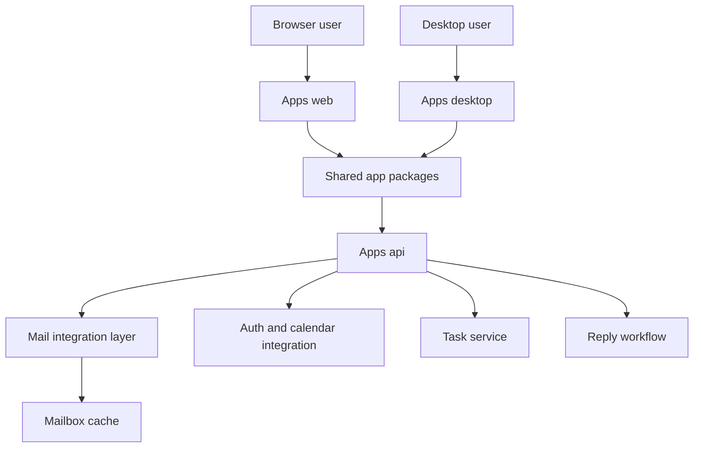
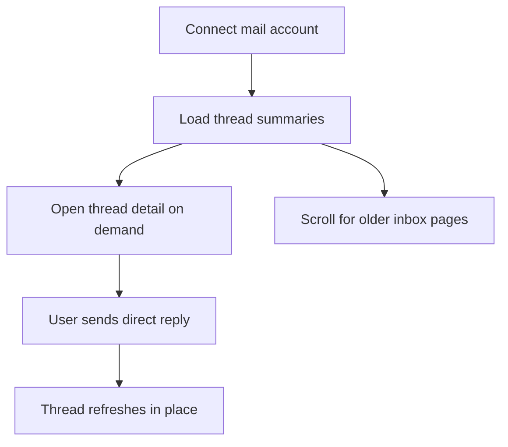

# InboxOS MVP

InboxOS is a mail-first AI workspace with one shared UI direction across the live web app and a planned macOS desktop shell.

## Monorepo Layout

- `apps/web`: Next.js host app for the current product surface
- `apps/desktop`: planned macOS desktop shell around the shared app packages
- `apps/api`: FastAPI backend for auth, mail, calendar, and tasks
- `packages/app`: shared app shell and route-level page composition
- `packages/features`: mail, tasks, calendar, and auth feature workspaces
- `packages/ui`: shared UI chrome such as the left app rail
- `packages/lib`: shared API client, formatters, and mock data
- `packages/types`: shared TypeScript models
- `packages/config`: shared client-side configuration
- `docs`: product and technical documentation
- `ui`: local ignored checkout of upstream `shadcn/ui` for reference only

## Architecture



## Core Flows



## Local Development

### Prereqs

- Python 3.11+
- `uv`
- Node 20+
- `bun`
- Docker
- Supabase CLI

### Backend

```bash
cp .env.example .env
# Set GOOGLE_CLIENT_ID and GOOGLE_CLIENT_SECRET in .env.
# Set CREDENTIAL_ENCRYPTION_KEY in .env.
# Enable Gmail API and Google Calendar API in the same Google Cloud project.

supabase start

cd apps/api
uv sync --group dev
uv run uvicorn app.main:app --reload --host 0.0.0.0 --port 8000
```

Local app state now defaults to Supabase Postgres at `127.0.0.1:54322`. Reset the local database with `supabase db reset` after schema changes or when you want a clean local environment.

### Web

```bash
cd apps/web
bun install
NEXT_PUBLIC_API_BASE_URL=http://localhost:8000 bun run dev
```

Open [http://localhost:3000/mail](http://localhost:3000/mail).

## Mail Workspace Behavior

- first mailbox paint loads the newest 20 Gmail inbox thread summaries
- full Gmail thread detail loads only when a thread is opened or deep-linked
- scrolling near the bottom loads older inbox pages
- search currently filters only the summaries already loaded in the client
- the current live mail integration uses Gmail, and the backend persists summary pages and opened thread detail in `GMAIL_CACHE_DB_PATH`, which defaults to `~/.cache/inboxos/gmail_mailbox_cache.sqlite3`

### Desktop

`apps/desktop` is a shell scaffold only. It exists to keep the repo aligned with the future macOS-compatible packaging plan, but the web app remains the active runtime today.

### Git Hooks

Enable the versioned pre-commit hooks once per clone:

```bash
make install-hooks
```

The repo uses the Python `pre-commit` package. Hooks run `black` and `ruff` on `apps/api`, and `prettier` across the tracked JS, TS, CSS, JSON, and Markdown files in `apps/`, `packages/`, and `docs/`.

To run the same checks manually across the repo:

```bash
uvx pre-commit run --all-files
```

## Test And Lint

```bash
cd apps/api
uv run --group dev ruff check
uv run --group dev python -m pytest

cd ../web
bun run lint
bun run build
```

## Docker Compose

```bash
docker compose up --build
```

- This starts the web app, API, and a local Postgres container that applies the SQL in `supabase/migrations` and `supabase/seed.sql` automatically.
- It is local-only. Railway and Vercel do not use `docker-compose.yml`.
- Do not run `supabase start` at the same time as `docker compose up`, because both want local database port `54322`.
- Compose uses its own internal database URL by default, so your root `.env` `DATABASE_URL` will not override the container-to-container connection.
- Google OAuth still requires `GOOGLE_CLIENT_ID` and `GOOGLE_CLIENT_SECRET` in your local `.env`; Compose now passes those through to the API container.
- If you want to reset the Compose-managed database, run `docker compose down -v` or `make down-v`.
- If you want Supabase Studio or the full Supabase CLI stack locally, use `supabase start` instead of Docker Compose.

- API: [http://localhost:8000](http://localhost:8000)
- Web: [http://localhost:3000](http://localhost:3000)
- Database: copy the local Postgres connection string from `supabase status -o env`

## Deploy

Deploys are branch-driven:

- `main` auto deploys the production environment on Vercel, Railway, and Supabase
- `gamma` auto deploys the gamma environment on Vercel, Railway, and Supabase

### Web on Vercel

- production branch: `main`
- gamma branch: `gamma`
- project root: `apps/web`
- build command: `bun run build`
- start command: `bun run start`
- enable source files outside the root directory because `apps/web` imports from `packages/*`
- env per environment: `NEXT_PUBLIC_API_BASE_URL`, `NEXT_PUBLIC_SESSION_COOKIE_NAME`

### API on Railway

- production branch: `main`
- gamma branch: `gamma`
- service root: `apps/api`
- deploy with `apps/api/Dockerfile`
- expose port `8000`
- set `DATABASE_URL` to the matching Supabase Postgres connection string for each environment
- set `CREDENTIAL_ENCRYPTION_KEY` in Railway for each environment
- set env vars from `.env.example` plus environment-specific overrides for `APP_ENV`, `SESSION_COOKIE_SECURE`, `CORS_ORIGINS`, and `WEB_BASE_URL`
- keep the `/data` volume only if `GMAIL_CACHE_DB_PATH` should survive container replacement
- optionally put `GMAIL_CACHE_DB_PATH` on persistent storage if mailbox cache should survive container replacement
- `GOOGLE_REDIRECT_URI` is optional on Railway when `RAILWAY_PUBLIC_DOMAIN` is available, but can still be set explicitly

### Supabase

- production branch: `main`
- gamma branch: `gamma`
- GitHub Actions deploys remote migrations and edge functions from `.github/workflows/supabase-release.yml`
- create separate Supabase projects for production and gamma, then map them to GitHub environments named `production` and `gamma`

See [docs/deployment/vercel-railway-runbook.md](./docs/deployment/vercel-railway-runbook.md) for the full provider setup and rollout sequence.

## Current MVP Status

Implemented:

- mail-first shared UI structure for web and future desktop shell reuse
- Google-backed auth start, callback, session, and logout flow with an HTTP-only session cookie
- Gmail inbox list backed by live Google data with summary-first loading and a persisted first-page cache
- full Gmail thread fetch on open plus live mailbox actions from the mail workspace
- infinite scroll for older inbox pages
- Google Calendar event loading in the calendar workspace
- mail, tasks, calendar, and auth surfaces in the web host app
