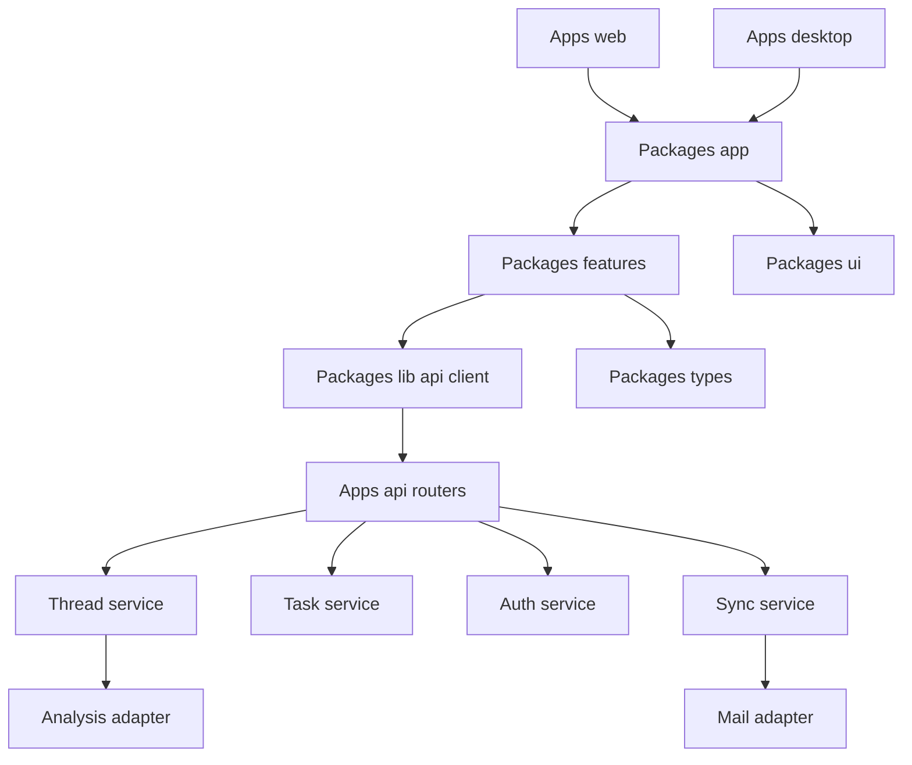

# Component Overview

This document describes the major runtime components and how they fit together.

## Runtime Overview

## Shared Frontend Components

### App shell

Primary file: `packages/app/src/app-shell.tsx`

Responsibilities:

- compose the left rail and active page area
- keep the top-level chrome shared across host apps

### Route composition

Primary files:

- `packages/app/src/routes/mail-page.tsx`
- `packages/app/src/routes/tasks-page.tsx`
- `packages/app/src/routes/calendar-page.tsx`
- `packages/app/src/routes/auth-page.tsx`

Responsibilities:

- keep route-level page assembly in one shared package
- let `apps/web` and later `apps/desktop` host the same screens

### Mail workspace

Primary file: `packages/features/src/mail/mail-workspace.tsx`

Responsibilities:

- load thread summaries and thread detail
- render the three-pane mail UI
- send replies through the thread reply endpoint
- reconcile API and demo fallback state

### Tasks workspace

Primary file: `packages/features/src/tasks/tasks-view.tsx`

Responsibilities:

- list tasks
- create tasks
- complete tasks
- filter and search task state

### Calendar workspace

Primary file: `packages/features/src/calendar/calendar-workspace.tsx`

Responsibilities:

- render day, week, and month views
- provide the calendar planning surface

### Auth workspace

Primary file: `packages/features/src/auth/auth-view.tsx`

Responsibilities:

- start Google auth flow
- present login and connection UI

### Shared UI chrome

Primary file: `packages/ui/src/app-rail.tsx`

Responsibilities:

- render the compact app-switching rail
- keep host-independent navigation chrome

### Shared client modules

Primary files:

- `packages/lib/src/api.ts`
- `packages/lib/src/mock-data.ts`
- `packages/types/src/index.ts`
- `packages/config/src/web.ts`

Responsibilities:

- centralize API requests
- keep demo fallback data in one place
- share stable TypeScript models across screens
- expose environment-driven client configuration

## Backend Components

### Thread service

Primary file: `apps/api/app/services/thread_service.py`

Responsibilities:

- list thread summaries
- fetch thread detail
- analyze threads
- send replies and mutate thread state

### Task service

Primary file: `apps/api/app/services/task_service.py`

Responsibilities:

- list tasks
- create tasks
- complete tasks
- create deadline-driven tasks from analyzed threads

### Sync service

Primary file: `apps/api/app/services/sync_service.py`

Responsibilities:

- import threads from the mail adapter
- analyze imported threads
- create derived tasks
- update sync status
