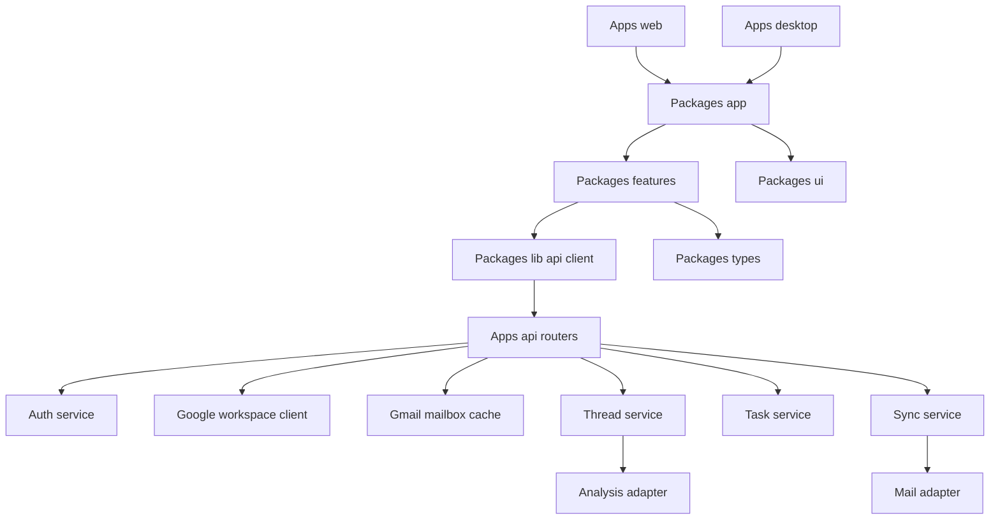

# Component Overview

This document describes the major runtime components and how they fit together.

## Runtime Overview

## Shared Frontend Components

### App shell

Primary file: `packages/app/src/app-shell.tsx`

Responsibilities:

- compose the left rail and active page area
- keep the top-level chrome shared across host apps

### Route composition

Primary files:

- `packages/app/src/routes/mail-page.tsx`
- `packages/app/src/routes/tasks-page.tsx`
- `packages/app/src/routes/calendar-page.tsx`
- `packages/app/src/routes/auth-page.tsx`

Responsibilities:

- keep route-level page assembly in one shared package
- let `apps/web` and later `apps/desktop` host the same screens

### Mail workspace

Primary file: `packages/features/src/mail/mail-workspace.tsx`

Responsibilities:

- load paginated Gmail thread summaries first
- fetch full thread detail only when a thread is opened or deep-linked
- append older inbox pages with infinite scroll
- render the three-pane mail UI
- send replies through the Gmail thread reply endpoint
- keep search scoped to the summaries already loaded in memory for the current session

### Tasks workspace

Primary file: `packages/features/src/tasks/tasks-view.tsx`

Responsibilities:

- list tasks
- create tasks
- complete tasks
- filter and search task state

### Calendar workspace

Primary file: `packages/features/src/calendar/calendar-workspace.tsx`

Responsibilities:

- render day, week, and month views
- provide the calendar planning surface

### Auth workspace

Primary file: `packages/features/src/auth/auth-view.tsx`

Responsibilities:

- start Google auth flow
- present login and connection UI

### Shared UI chrome

Primary file: `packages/ui/src/app-rail.tsx`

Responsibilities:

- render the compact app-switching rail
- keep host-independent navigation chrome

### Shared client modules

Primary files:

- `packages/lib/src/api.ts`
- `packages/lib/src/mock-data.ts`
- `packages/types/src/index.ts`
- `packages/config/src/web.ts`

Responsibilities:

- centralize auth, Gmail, calendar, task, and legacy thread API requests
- keep demo fallback data in one place for the remaining in-memory flows
- share stable TypeScript models across screens
- expose environment-driven client configuration

## Backend Components

### Auth service

Primary file: `apps/api/app/services/auth_service.py`

Responsibilities:

- build the Google OAuth start URL
- exchange the OAuth callback for Google tokens and user profile data
- create, refresh, load, and clear authenticated sessions
- normalize safe redirect targets back into the web app

### Google workspace client

Primary file: `apps/api/app/integrations/google_workspace.py`

Responsibilities:

- fetch paginated Gmail inbox summaries
- fetch full Gmail thread detail and send Gmail replies
- fetch Google Calendar events
- normalize Google API failures into app-friendly error messages

### Gmail mailbox cache

Primary file: `apps/api/app/storage/mailbox_cache.py`

Responsibilities:

- persist Gmail summary pages by account, query, and page token
- persist opened Gmail thread detail by account and thread id
- serve cached first-page inbox summaries before a background refresh

### Thread service

Primary file: `apps/api/app/services/thread_service.py`

Responsibilities:

- manage the legacy in-memory thread list
- analyze stub-backed threads
- return thread detail for the analysis and task demo flows
- send direct replies in the legacy thread path

### Task service

Primary file: `apps/api/app/services/task_service.py`

Responsibilities:

- list tasks
- create tasks
- complete tasks
- create deadline-driven tasks from analyzed threads

### Sync service

Primary file: `apps/api/app/services/sync_service.py`

Responsibilities:

- import stub-backed threads from the mail adapter
- analyze imported threads through the legacy thread service
- create derived tasks for the demo flow
- update in-memory sync status
