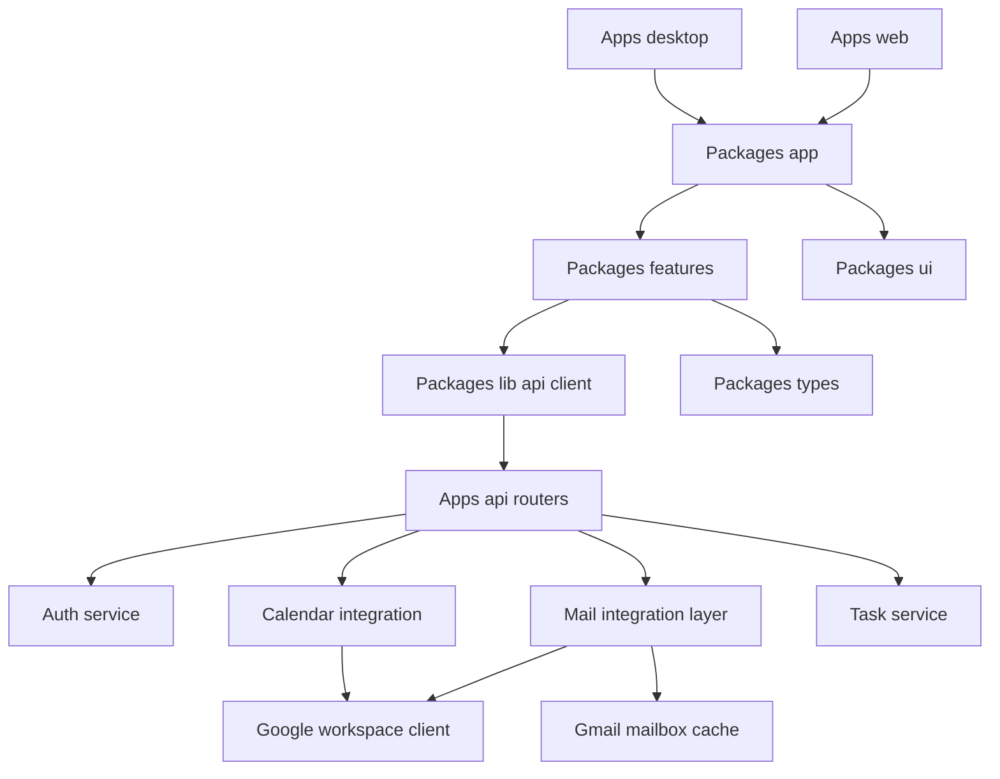

# Component Overview

This document describes the major runtime components and how they fit together.

## Runtime Overview

## Shared Frontend Components

### App shell

Primary file: `packages/app/src/app-shell.tsx`

Responsibilities:

- compose the left rail and active page area
- keep the top-level chrome shared across host apps

### Route composition

Primary files:

- `packages/app/src/routes/mail-page.tsx`
- `packages/app/src/routes/tasks-page.tsx`
- `packages/app/src/routes/calendar-page.tsx`
- `packages/app/src/routes/auth-page.tsx`

Responsibilities:

- keep route-level page assembly in one shared package
- let `apps/web` and later `apps/desktop` host the same screens

### Mail workspace

Primary file: `packages/features/src/mail/mail-workspace.tsx`

Responsibilities:

- load paginated thread summaries first
- fetch full thread detail only when the user opens a thread or deep link
- render the three-pane mail UI
- load older inbox pages with infinite scroll
- keep search local to already-loaded summaries
- send replies through the Gmail thread reply endpoint

### Tasks workspace

Primary file: `packages/features/src/tasks/tasks-view.tsx`

Responsibilities:

- list tasks
- create tasks
- complete tasks
- filter and search task state
- fall back to demo task data if the live task API is empty or unavailable

### Calendar workspace

Primary file: `packages/features/src/calendar/calendar-workspace.tsx`

Responsibilities:

- render day, week, and month views
- load calendar events from the backend for the authenticated account
- provide the calendar planning surface

### Auth workspace

Primary file: `packages/features/src/auth/auth-view.tsx`

Responsibilities:

- start Google auth flow
- restore the current session through the backend
- present login and connection UI

### Shared UI chrome

Primary file: `packages/ui/src/app-rail.tsx`

Responsibilities:

- render the compact app-switching rail
- keep host-independent navigation chrome

### Shared client modules

Primary files:

- `packages/lib/src/api.ts`
- `packages/lib/src/mock-data.ts`
- `packages/types/src/index.ts`
- `packages/config/src/web.ts`

Responsibilities:

- centralize API requests
- keep demo fallback task data in one place
- share stable TypeScript models across screens
- expose environment-driven client configuration

## Backend Components

### Auth service

Primary file: `apps/api/app/services/auth_service.py`

Responsibilities:

- start Google OAuth
- complete the callback exchange
- restore or refresh persisted sessions
- clear the current session on logout

### Mail integration layer

Primary files:

- `apps/api/app/routers/gmail.py`
- `apps/api/app/integrations/google_workspace.py`
- `apps/api/app/storage/mailbox_cache.py`

Responsibilities:

- return paginated thread summaries
- fetch full thread detail on demand
- send direct replies through Gmail
- persist cached summary pages and opened thread detail

### Task service

Primary file: `apps/api/app/services/task_service.py`

Responsibilities:

- list tasks
- create tasks
- complete tasks

### Legacy note

The removed legacy demo mail path is no longer part of the active runtime.
The live mail surface now runs through `/gmail/*`.
