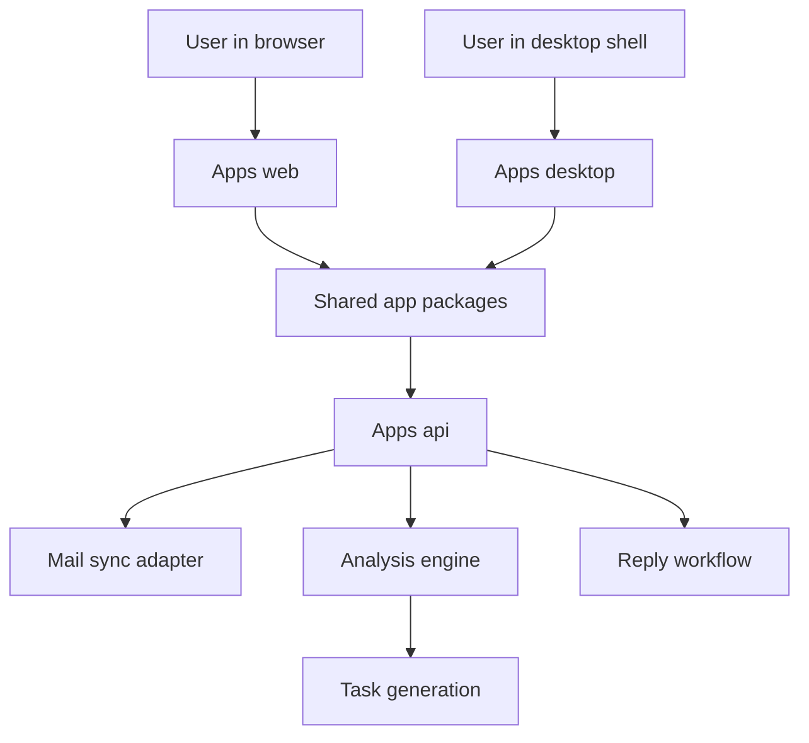

# System Context

This document explains the current product boundary and runtime shape.

## Product Surface

InboxOS currently centers on four app surfaces:

- mail
- tasks
- calendar
- auth

The primary entry route remains `/mail`.

## System Context

## Responsibilities

### `apps/web`

The web host owns:

- the live Next.js runtime
- route entry points under `apps/web/app`
- global CSS and metadata for the current production surface

### `apps/desktop`

The desktop app owns:

- the future macOS shell around the shared UI packages
- preload and runtime integration points for desktop-specific APIs
- packaging concerns separate from the shared UI logic

### `packages/`

The shared packages own:

- app shell composition
- mail, tasks, calendar, and auth screens
- shared UI chrome
- shared API client, types, mock data, and config

### `apps/api`

The API owns:

- thread sync
- thread analysis
- direct thread reply mutation
- task creation and completion
- auth start and callback endpoints

## Delivery Plan

The current hosting plan is:

- Vercel for `apps/web`
- Railway for `apps/api`
- local-only packaging work for `apps/desktop` until the shared UI is stable
