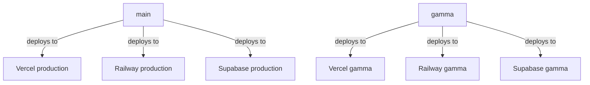

# Deployment Architecture

This document captures the intended deployment shape for the current MVP.

## Branch Environments

- `main` is the production release branch
- `gamma` is the gamma release branch
- Vercel and Railway auto deploy from their configured Git branch per environment
- Supabase is released by GitHub Actions from the same branch mapping



## Hosting Plan

### Web

Platform: Vercel

Expected settings:

- production project branch: `main`
- gamma project branch: `gamma`
- project root: `apps/web`
- build command: `bun run build`
- start command: `bun run start`
- enable source files outside the root directory because the app imports from `packages/*`
- env per environment: `NEXT_PUBLIC_API_BASE_URL`
- env per environment: `NEXT_PUBLIC_SESSION_COOKIE_NAME`

### API

Platform: Railway

Expected settings:

- production environment branch: `main`
- gamma environment branch: `gamma`
- service root: `apps/api`
- port: `8000`
- deploy with `apps/api/Dockerfile`
- set `DATABASE_URL` to the matching Supabase Postgres connection string for each environment
- set `CREDENTIAL_ENCRYPTION_KEY` for provider token encryption in each environment
- attach a persistent volume at `/data` only if Gmail cache should survive restarts
- env vars from `.env.example` plus environment-specific overrides for `APP_ENV`, cookie security, allowed origins, and OAuth callback URLs
- public networking enabled with a distinct Railway-provided domain per environment

### Database

Platform: Supabase

Expected settings:

- production project branch: `main`
- gamma project branch: `gamma`
- separate hosted Supabase projects for production and gamma
- GitHub Actions workflow: `.github/workflows/supabase-release.yml`
- GitHub environments named `production` and `gamma` hold `SUPABASE_ACCESS_TOKEN`, `SUPABASE_PROJECT_ID`, and `SUPABASE_DB_PASSWORD`
- use Supabase local Docker through the CLI for local development
- use `docker compose up --build` only for local all-in-one startup
- keep schema migrations in `supabase/migrations`
- keep edge functions in `supabase/functions`
- Railway is the only deployed service that receives the Supabase database connection string

### Desktop

Platform: not deployed yet

Current expectation:

- local macOS packaging only after the shared app packages are stable
- no production desktop deployment target during the current MVP phase

## Local Development

### Backend

```bash
supabase start

cd apps/api
uv sync --group dev
uv run uvicorn app.main:app --reload --host 0.0.0.0 --port 8000
```

### Frontend

```bash
cd apps/web
bun install
NEXT_PUBLIC_API_BASE_URL=http://localhost:8000 bun run dev
```

### Full Stack With Docker

```bash
docker compose up --build
```

`docker-compose.yml` is local-only. It starts the web app, API, and a Compose-managed Postgres instance seeded from `supabase/migrations`. It does not affect Railway or Vercel deployment settings.

## One Command Release Trigger

Runtime deployments stay branch-driven:

- push or update `gamma` to trigger the gamma Railway, Vercel, and Supabase environments
- push or update `main` to trigger production

Use the repo release wrapper when the provider integrations are already configured:

```bash
make deploy-gamma
make deploy-main
```

Those targets call `scripts/deploy-branch.sh`, verify a clean working tree, require a fast-forward release, and then push the exact commit to the target branch as the single deployment trigger.

## Constraints

- auth, tasks, linked accounts, and conversation state persist in Supabase
- Gmail cache is still optional local disk state
- calendar has no backend service yet
- auth is not enforced app-wide yet
- future macOS packaging comes after the shared web surface is stable

See [vercel-railway-runbook.md](./vercel-railway-runbook.md) for the provider setup sequence and branch-to-environment contract.
