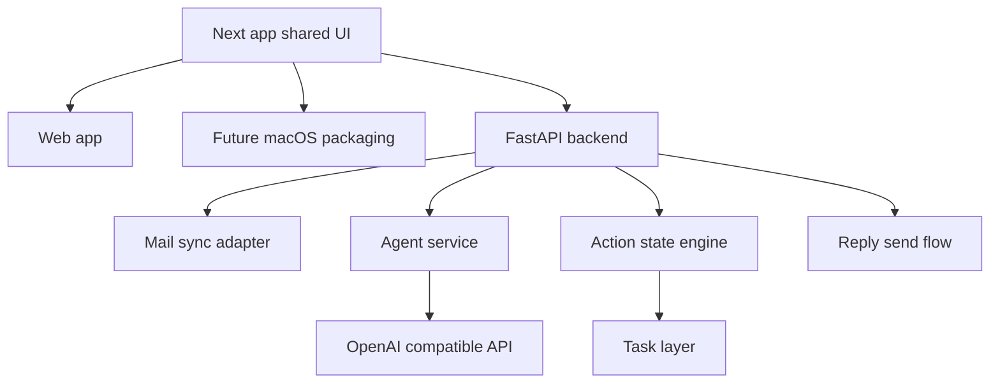

# InboxOS MVP PRD

## Overview

InboxOS is an AI email workspace with one shared interface across web and planned macOS usage. The app uses a Next.js UI for the shared product surface, and the first UX target is a macOS Mail-inspired layout adapted for a mail-first workflow.

## Problem

Users spend too much time:

- reading long email threads to find action items
- deciding what needs a reply, a follow-up, or a reminder
- manually tracking deadlines and next steps outside email
- switching between email and task tools

## Goal

Build an MVP that helps users process Gmail faster by:

- extracting summaries, action items, and deadlines from emails
- generating reminders and tasks from email content
- keeping one familiar Mail-style interface on both web and future macOS packaging
- supporting direct reply from the mail workspace
- keeping users in control of outbound actions

## Target User

Professionals with high email volume, especially users handling recruiting, sales, networking, or lead-heavy conversations.

## UX Direction

### Base UI

Use a Mail app-inspired layout first, not a dashboard-first web UI.

Core layout:

- left sidebar for app switching and mailbox context
- thread list pane in the center
- reading pane on the right
- task and calendar as adjacent surfaces, not the primary landing experience

### Added InboxOS Controls

Add product-specific controls into that familiar layout:

- action chips on each thread: To Reply, To Follow Up, Task, FYI
- task management surface for extracted or manual tasks
- AI summary and extracted action cards in thread detail context
- direct reply flow inside the mail workspace

## MVP Scope

### Core Features

#### 1. Cross-platform client direction

- web app: Next.js
- future macOS packaging should preserve the same interface
- shared UI direction across both clients
- platform-specific code kept minimal

#### 2. Email integration

- support Gmail first
- sync inbox and sent mail
- design provider layer so other email providers can be added later

#### 3. AI parsing

For each email or thread, extract:

- short summary
- action items
- deadlines or date-based follow-up needs
- requested information or requested documents
- recommended next action

#### 4. Task and reminder generation

A single email or thread may produce multiple action states at once:

- needs reply
- needs follow-up
- has deadline
- needs reminder task

System should:

- auto-create a task or reminder from email context
- keep tasks in-app for MVP
- leave Apple Reminders integration for later
- categorize created tasks based on email intent and deadline context

#### 5. Action-based inbox view

Email should not be reorganized into product-specific folders.

InboxOS should maintain action views on top of the inbox:

- To Reply
- To Follow Up
- Tasks
- FYI

The same email can appear in multiple views at the same time.

#### 6. Reply workflow

Users should be able to reply directly from the mail workspace.

System should:

- keep reply in the main mail UI
- update thread state after reply
- keep the user in control of outbound actions

#### 7. Safety and control

- no autonomous sending in MVP
- user-triggered outbound actions only
- action views must stay understandable and reversible by the user

## Non Goals

- native SwiftUI desktop UI for v1
- visual workflow builder
- full multi-provider rollout
- end-to-end encrypted email support
- fully autonomous email sending

## User Stories

- As a user, I want a familiar Mail-style layout so I can adopt the app quickly.
- As a user, I want the same product feel on web and future macOS packaging.
- As a user, I want my emails summarized into clear action items so I can process my inbox faster.
- As a user, I want deadlines and follow-up needs turned into reminder tasks automatically.
- As a user, I want one email to appear in multiple action views if needed.
- As a user, I want to reply from the mail workspace without switching to a separate flow.

## Success Criteria

- user can connect Gmail and sync inbox successfully
- web and future macOS packaging share the same UI direction and flows
- system generates useful summaries, action items, and deadlines per thread
- system creates reminder and task items from relevant emails
- system supports overlapping action states for a single email
- user can reply directly from the mail workspace

## Initial Tech Plan

### Stack

- shared UI: Next.js + shadcn/ui
- backend API: Python + FastAPI
- LLM layer: OpenAI-compatible API
- reminder layer: in-app task module first
- deployment: Vercel for web, Railway for API

### Architecture

