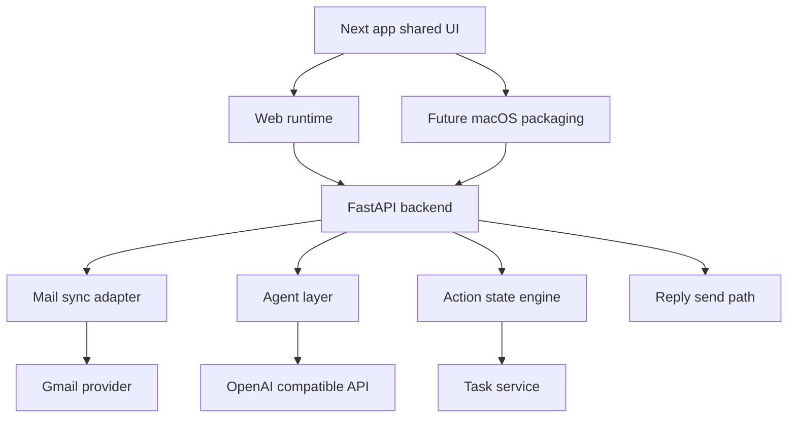

# InboxOS MVP RFC

## 1. Summary

InboxOS is a mail-first AI email workspace for Gmail-first users. The frontend is built in Next.js, and the design direction aims to preserve the same interface across web and future macOS packaging.

## 2. Goals

- keep one shared UI direction across web and future macOS packaging
- ship a Mail-style three-pane layout first
- sync Gmail threads reliably
- extract summary, action items, deadlines, and requested info or documents
- maintain action views: To Reply, To Follow Up, Tasks, FYI
- support direct reply from the mail workspace

## 3. Non Goals

- separate native SwiftUI app in v1
- autonomous sending
- full multi-provider rollout in v1
- workflow builder
- PGP or S MIME

## 4. High Level Architecture



## 5. Tech Choices

### Frontend

- Next.js for shared app
- shadcn/ui for component primitives
- bun for JS package management

Why:

- one codebase for the live web app
- consistent routing and components
- easier path to preserve the same UI in future macOS packaging

### Backend

- Python FastAPI
- uv for Python package management

### Mail Integration

- MailCore2 or similar OSS mail sync library

### LLM Provider

- OpenAI-compatible API

## 6. Deployment

### MVP deployment plan

- Web: Vercel
- API: Railway

Reason:

- low ops for web and API
- clean separation between frontend and backend services

## 7. Core Flows

### 7.1 Shared UI runtime flow

1. Render the shared Next.js routes in the browser
2. Use a shared API client and shared state model
3. Preserve the same visual direction for future macOS packaging

### 7.2 Email ingestion

1. Sync inbox and sent mail
2. Normalize thread structure
3. Send thread to the agent layer
4. Extract summary, actions, deadlines, and recommended next step

### 7.3 Action state generation

A thread can appear in multiple action views at once:

- To Reply
- To Follow Up
- Tasks
- FYI

### 7.4 Reply flow

1. User opens a thread in the mail workspace
2. User sends a reply from the compose area
3. Backend updates thread state and returns the updated thread
4. UI refreshes the reading pane and summary list

## 8. UI Contract

### 8.1 Primary layout

Mail-inspired three-pane layout:

- sidebar
- thread list
- reading pane

### 8.2 InboxOS additions

- action chips in thread list rows
- AI summary block in the reading pane
- extracted tasks and deadlines block in the reading pane
- dedicated tasks route
- dedicated calendar route

### 8.3 Why this layout

- familiar mental model
- less custom design work for MVP
- easier parity between web and future macOS packaging

## 9. API Shape

- `POST /sync/start`
- `GET /sync/status`
- `GET /threads`
- `GET /threads/{id}`
- `POST /threads/{id}/analyze`
- `POST /threads/{id}/reply`
- `GET /tasks`
- `POST /tasks/create`
- `POST /tasks/{id}/complete`

## 10. Repo Shape

```text
inboxos/
├── apps/
│   ├── web/
│   ├── desktop/
│   └── api/
├── packages/
│   ├── app/
│   ├── ui/
│   ├── features/
│   ├── lib/
│   ├── types/
│   └── config/
├── docs/
├── ui/
└── docker-compose.yml
```

## 11. Key Decisions

### Shared app packages instead of duplicated client UIs

This keeps the live product surface concentrated in shared packages and makes future macOS packaging easier to align.

### In-app tasks before external reminders

Keep action lifecycle inside the product first. External reminder integrations can come later.

### Mail-first surface instead of dashboard-first surface

This keeps the product aligned to the core user workflow.
